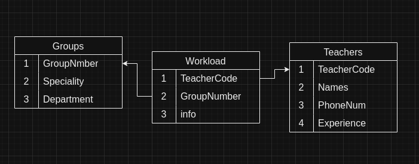
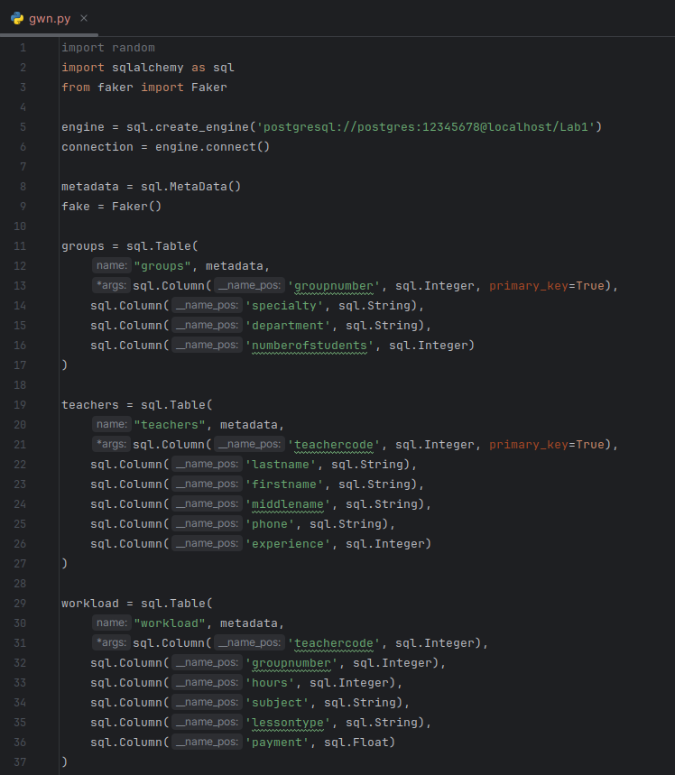
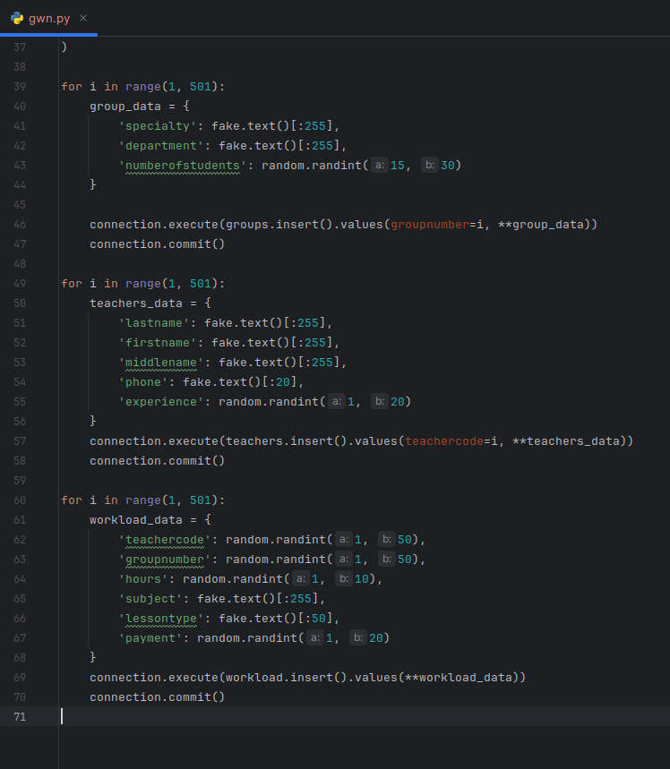
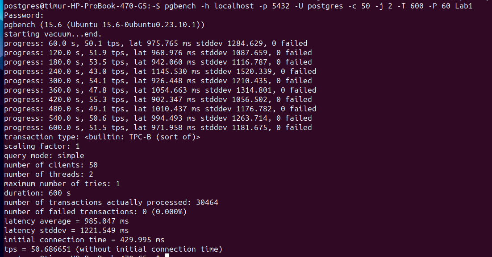

# Лабораторная работа 1. Вариант 9.

## Концептуальный вид:
  Для наачала представим концептуальную модель нашей базы.
  наша база состоит из трех таблиц:
  - Группы (Номер группы, Специальность, Отделение, Количество студентов).
  - Преподаватели (Код преподавателя, Фамилия, Имя, Отчество, Телефон, Стаж).
  - Нагрузка (Код преподавателя, Номер группы, Количество часов, Предмет, Тип занятия, Оплата).

## Подключение к базе:
  Использовал библиотку sqlalchemy для соединения с базой данных. 
  

## Генерация и заполнение данными:
  Генерация осуществлена с помощью библиотек Faker и Random.
  

## Проведение бенчмарка

## Итог
Научились подключаться к базам данных и геерировать данные и заполнять таблицы в базе данных с помощью библиотек в Python, 
а так-же проводить бенчмарк используя pgbench.
