# Лабораторная работа 10
## Вариант 9, Минуллин Тимур, группа 11-209

## В ходе выполнения данной лабораторной работы мы выполним по 5 запросов на ROLLUP, GROUPING SET, CUBE к OLAP базе данных из предыдущих работ.

## Запросы на ROLLUP.

### 1.Количество медалей по странам и видам спорта с промежуточными итогами:
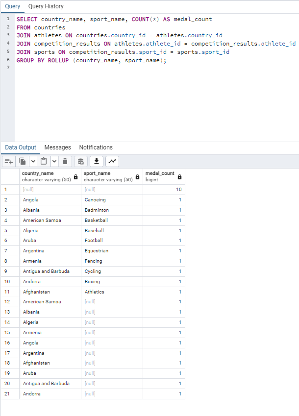

### 2. Количество соревнований по местам проведения и времени проведения с промежуточными итогами:
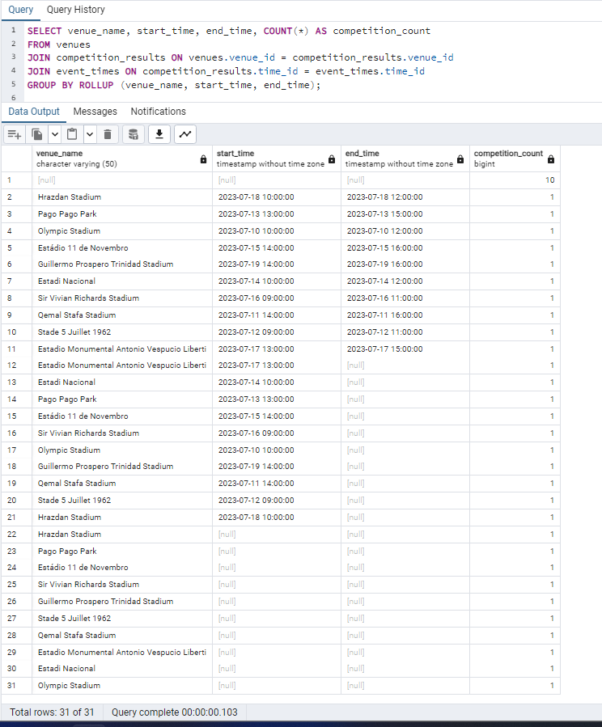

### 3. Количество участников соревнований по спортсменам и странам с промежуточными итогами:
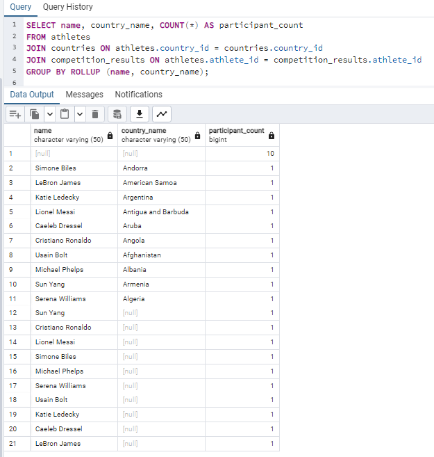

### 4. Количество медалей по странам, видам спорта и местам проведения с промежуточными итогами:
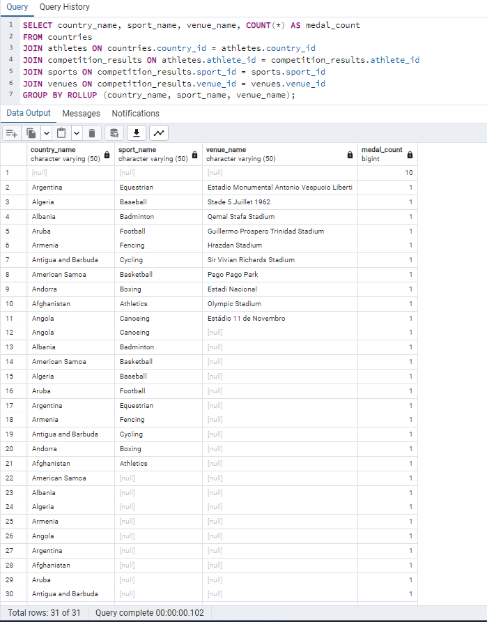

### 5. Количество соревнований по местам проведения, времени проведения и спортсменам с промежуточными итогами:
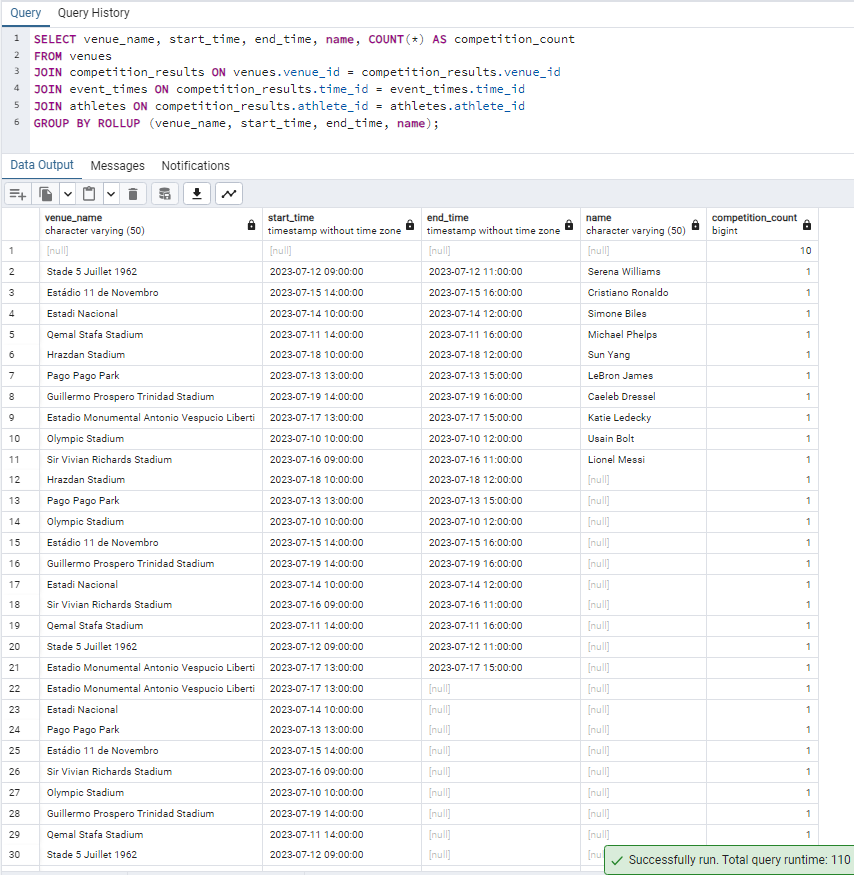

## Запросы на GROUPING SETS.

### 1. Количество медалей по странам и видам спорта:
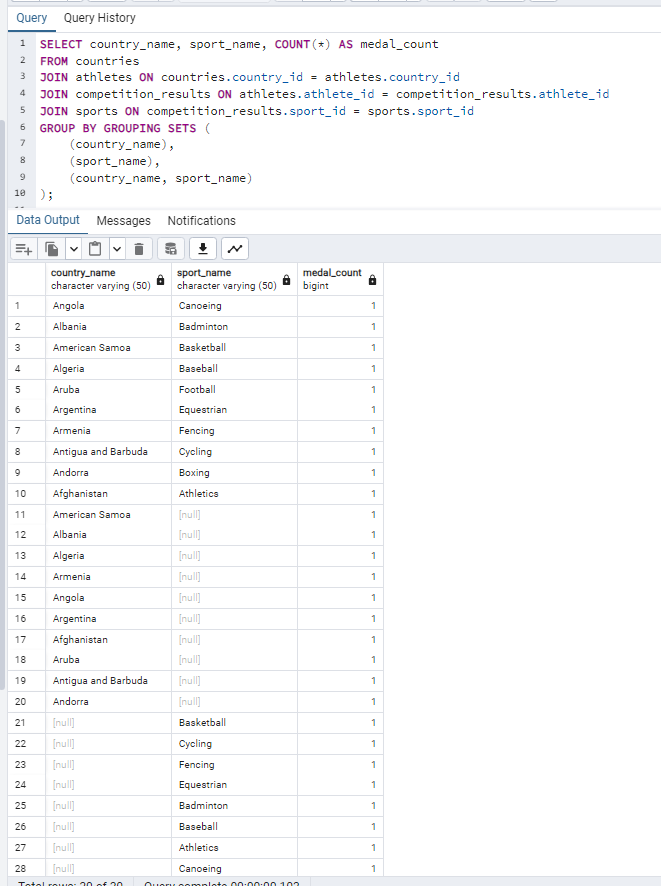

### 2. Количество соревнований по местам проведения и времени проведения:
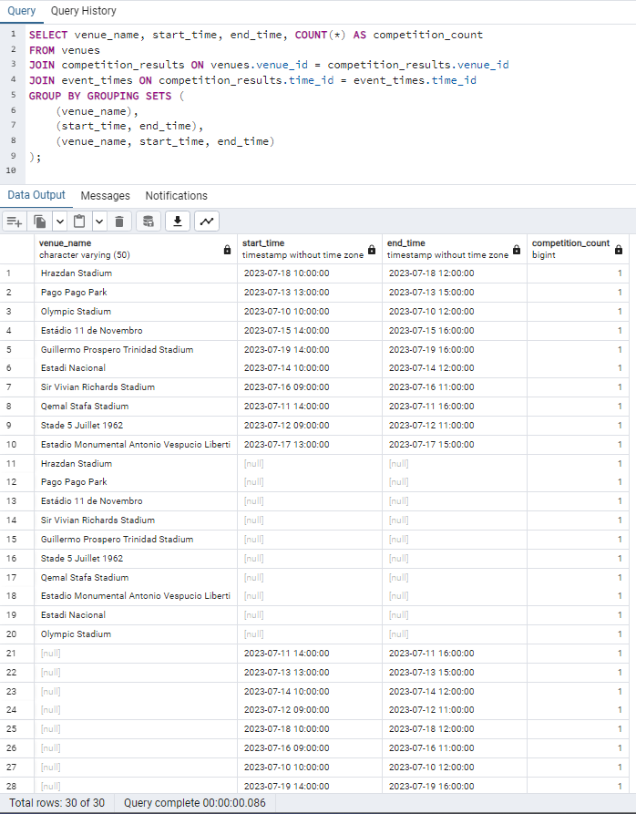

### 3. Количество участников соревнований по спортсменам и странам:
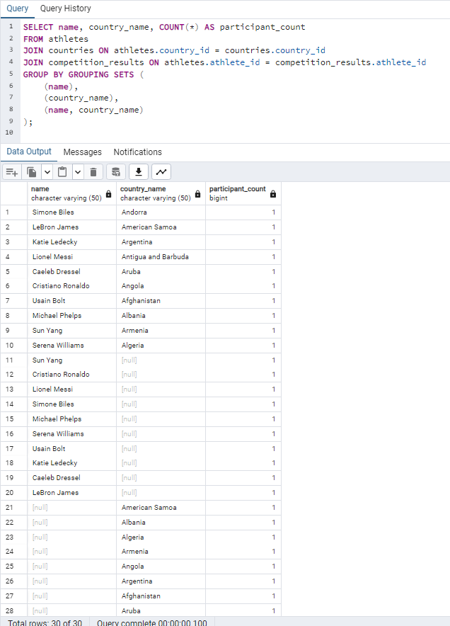

### 4. Количество медалей по странам, видам спорта и местам проведения:
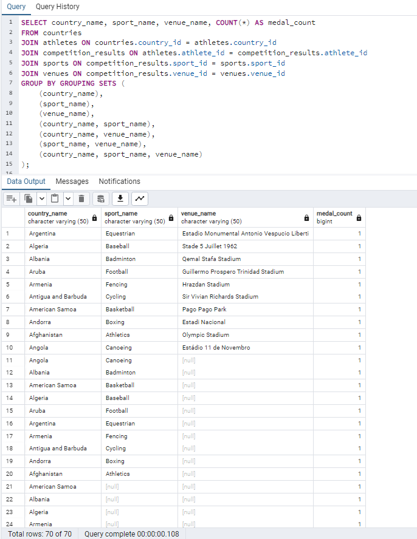

### 5. Количество соревнований по местам проведения, времени проведения и спортсменам:
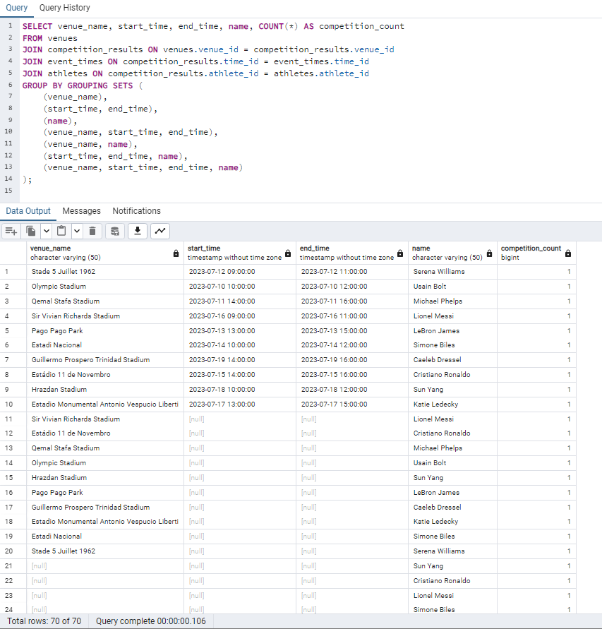

## Запросы на CUBE.

### 1. Количество медалей по странам, видам спорта и местам проведения с кубами:
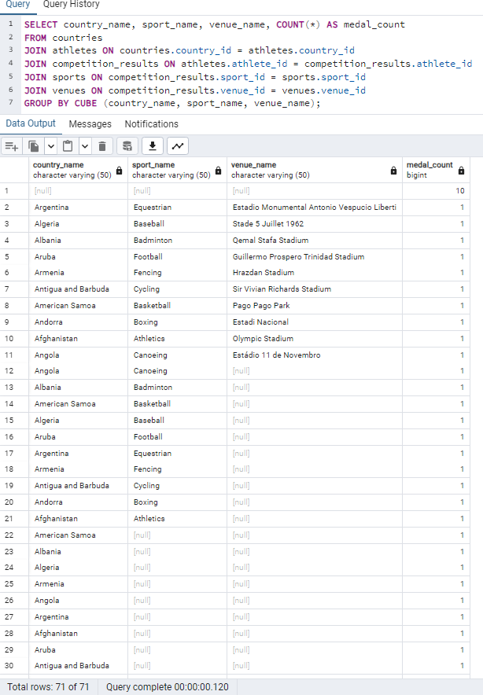

### 2. Количество соревнований по местам проведения, времени проведения и спортсменам с кубами:
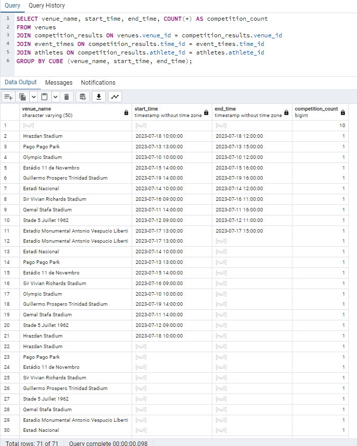

### 3. Количество участников соревнований по странам, видам спорта и местам проведения с кубами:
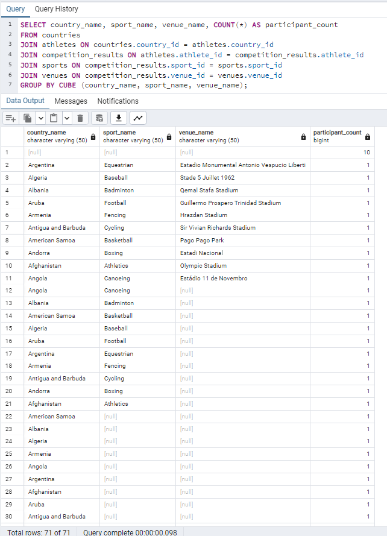

### 4. Количество медалей по странам, видам спорта, местам проведения и времени проведения с кубами:
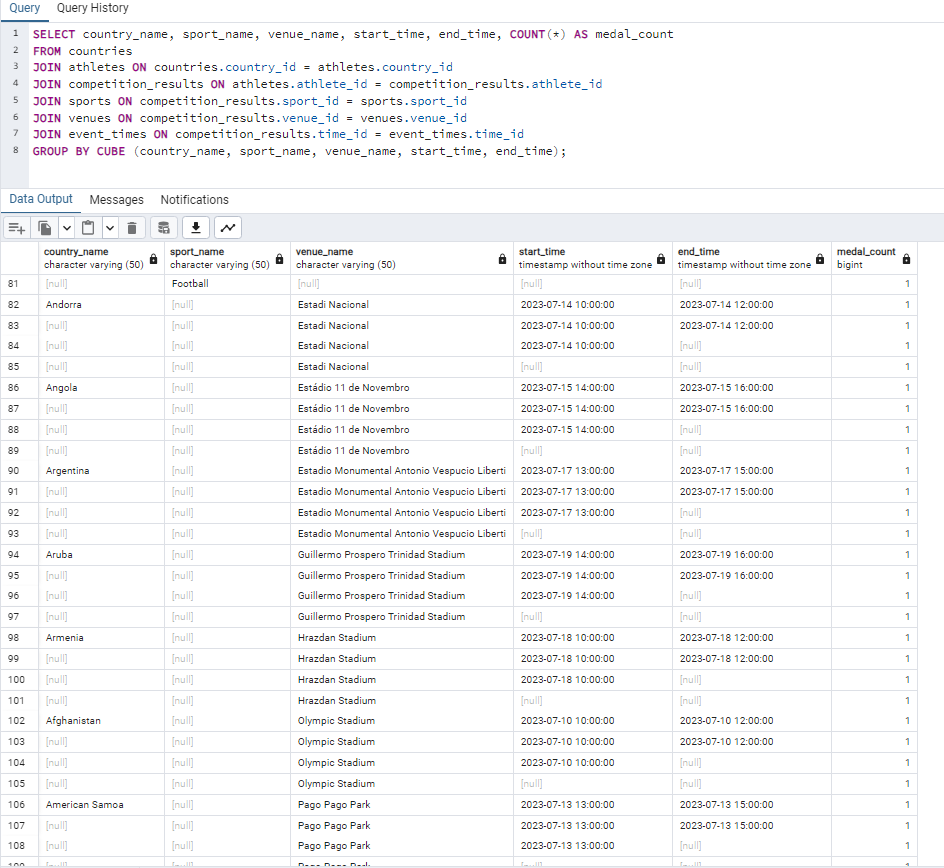

### 5. Количество соревнований по местам проведения, времени проведения, спортсменам и странам с кубами:
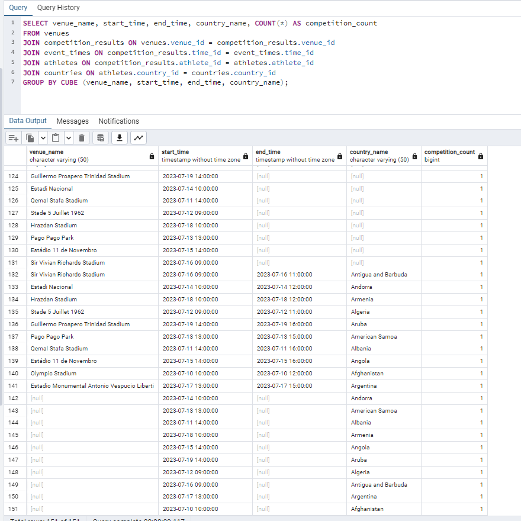
