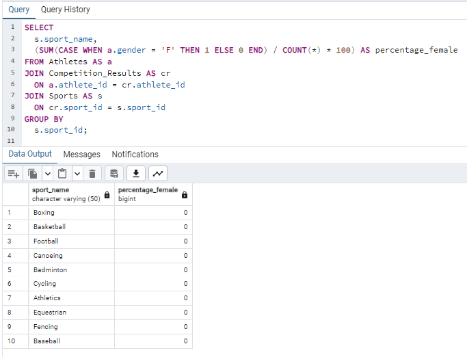

# Лабораторная работа 11
## Вариант 9, Минуллин Тимур, группа 11-209

## В ходе выполнения данной лабораторной работы мы построим и выполним OLAP-запросы с использованием аналитических функций

### 1. Получить список городов с количеством проведенных в них соревнований.

### 2. Получить список спортсменов с их рангом в соревнованиях по бегу, отсортированный по времени.

### 3. Использование PARTITION BY и RANK для получения списка спортсменов с их рангом в соревнованиях по плаванию, с разбивкой по странам.

### 4. Использование LAG для получения предыдущего времени соревнования для каждого спортсмена в соревнованиях по бегу.

### 5. Использование LEAD для получения следующего времени соревнования для каждого спортсмена в соревнованиях по прыжкам в длину. 

### 6. Использование OVER для вычисления среднего времени соревнования по каждому виду спорта.

### 7. Использование OVER для вычисления ранга каждого спортсмена в соревнованиях по каждому виду спорта.

### 8. Использование OVER для вычисления среднего времени соревнования по каждому виду спорта.

### 9. Использование OVER для вычисления разницы во времени между лучшим и худшим результатами в соревнованиях по прыжкам в длину.

### 10. Использование OVER для вычисления количества спортсменов из каждой страны, участвовавших в соревнованиях по бегу.

### 11. Использование OVER для вычисления процента женщин-спортсменок в каждом виде спорта.

### 12. Использование OVER для вычисления скользящего среднего времени соревнования для каждого спортсмена в соревнованиях по бегу.

