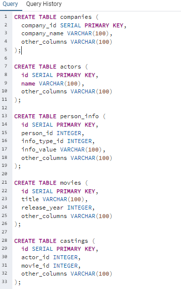
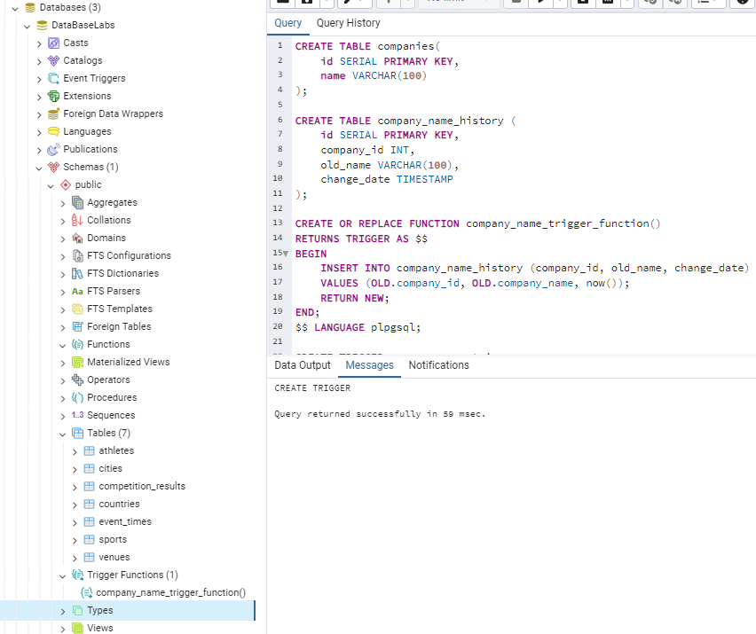
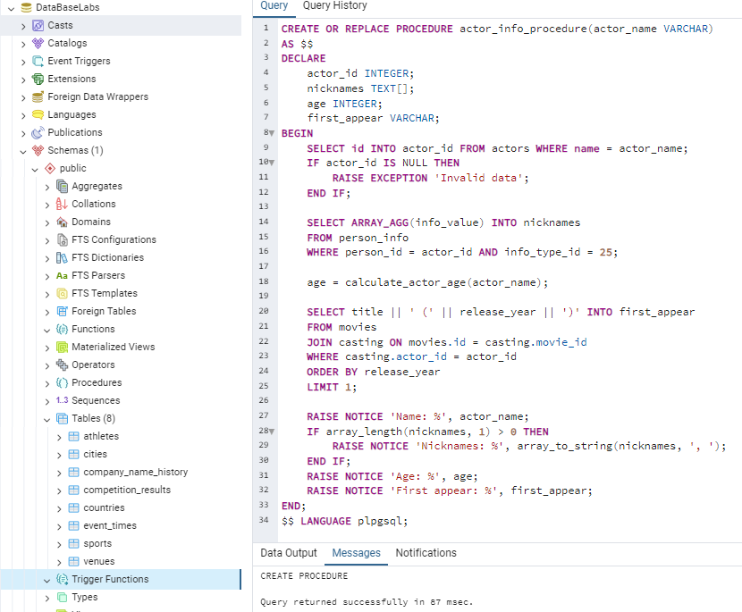

# Лабораторная работа 12
## Минуллин Тимур, группа 11-209

## В ходе выполнения данной лабораторной работы мы познакомимся и сгенерируем триггер, функцию и процедуру.

## Для начала создадим все нужные таблицы для выполнения задания:

### 1. Создание таблицы истории изменений company_name и триггера:

### 1. Создание таблицы истории изменений company_name и триггера:

### 3. Создание процедуры для вывода информации о актере:

