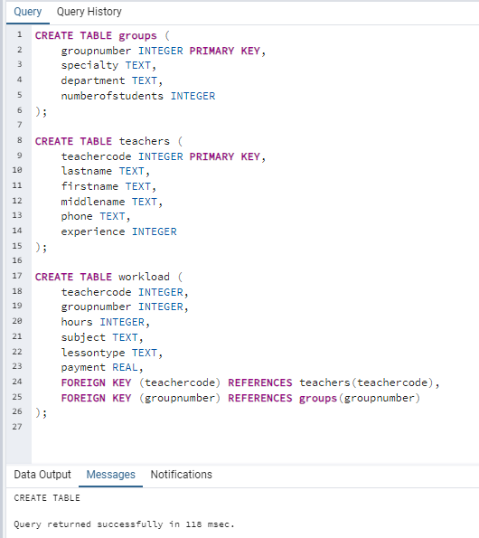

# Лабораторная работа 13
## Вариант 9, Минуллин Тимур, группа 11-209

## Концептуальный вид базы:
 Для наачала вспомним модель нашей базы.
  наша база состоит из трех таблиц:
  - Группы (Номер группы, Специальность, Отделение, Количество студентов).
  - Преподаватели (Код преподавателя, Фамилия, Имя, Отчество, Телефон, Стаж).
  - Нагрузка (Код преподавателя, Номер группы, Количество часов, Предмет, Тип занятия, Оплата).

## Приступим к работе с триггерами.
  Создадим 3 триггера:

  ### 1. Триггер для проверки и ограничения количества студентов в группе 
    Этот триггер будет проверять, что количество студентов в группе не превышает 50.

  ### 2. Триггер для проверки корректности номера телефона преподавателя
    Этот триггер будет проверять, что номер телефона преподавателя соответствует формату (10 цифр).

  
  ### 3. Триггер для автоматического обновления платежа
    Этот триггер будет автоматически обновлять поле payment в зависимости от типа занятия и количества часов.

## Проверим работоспособность каждого триггера.

### 1. Проверка триггера для ограничения количества студентов в группе

Успешная вставка (количество студентов <= 50)

Ошибка при вставке (количество студентов > 50)

### 2. Проверка триггера для корректности номера телефона преподавателя

Успешная вставка (корректный номер телефона)

Ошибка при вставке (некорректный номер телефона)

### 3. Проверка триггера для автоматического обновления платежа

Удачные вставки занятий 

Ошибка при вставке с неизвестным типом занятия

## Удалим все существующие триггеры и принадлежащие им функции.

