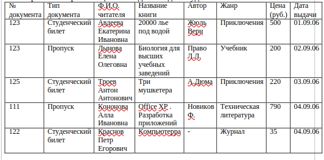
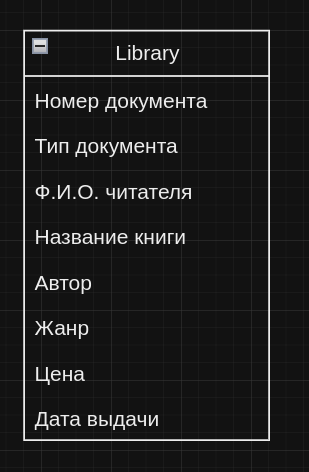
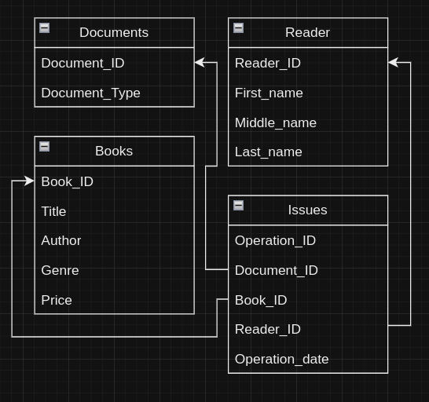

# Лабораторная работа 2. Вариант 9.

## Основная задача:
Нормализовать предоставленную базу данных.

## Начальная база данных:

## В ходе нормализации:
  Мы применили изученые рвнее методы нормализации базы данных.
  - Выделение первичных ключей.
  - Распределение значений так, что каждая ячейка содержит атомарное значение.
  - Устранение частичной зависимости. Выделили в отдельные таблицы атрибуты, которые зависят от полного первичного ключа.
  - Устранили транзитивную зависимость.

## Результат нормализации:
- Документы (Номер документа, Тип документа)
- Читатели (ФИО читателя)
- Книги (Название книги, Автор, Жанр, Цена)
- Выдачи (Номер документа, Название книги, ФИО читателя, Дата выдачи)

## Связи в полученной базе данных:
  1. Документы
     - Document_Id - первичный ключ.
  2. Читатели
     - Reader_ID - первичный ключ.
  3. Книги
     - Book_ID - первичный ключ.
  4. Выдачи.
     - document_id с таблицей Документы.
     - book_id с таблицей Книги.
     - reader_id с таблицей Читатели.

Первичные и внешние ключи структурированы для обеспечения целостности данных и эффективной работы с информацией в базе данных студенческой библиотеки. 
