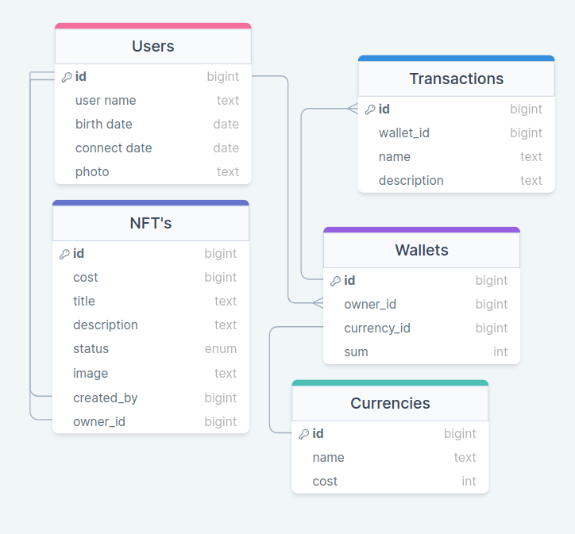

# Лабораторная работа 5. 

## В ходе выполнения данной лабораторной работы я бы хотел использовать свою базу данных. Опишем базу:
### Эта база данных для веб - приложения по покупке и продаже NFT картинок.

### Представим даталогическую модель проекта:


### Таблицы в базе данных:

1. **Users (Пользователи):**
   - **user_id**: Уникальный идентификатор пользователя.
   - **username**: Имя пользователя.
   - **email**: Email пользователя.
   - **registration_date**: Дата регистрации пользователя.

2. **Wallets (Кошельки):**
   - **wallet_id**: Уникальный идентификатор кошелька.
   - **user_id**: Ссылка на пользователя (связь с таблицей Users).
   - **currency_id**: Ссылка на валюту (связь с таблицей Currencies).
  
3. **Currencies (Валюты):**
   - **currency_id**: Уникальный идентификатор валюты.
   - **name**: Название валюты.
   - **symbol**: Символ валюты.

3. **NFTs (NFT-картинки):**
   - **nft_id**: Уникальный идентификатор NFT-картинки.
   - **name**: Название NFT-картинки.
   - **price**: Цена NFT-картинки.
   - **image_url**: URL изображения NFT.

4. **Transactions (Транзакции):**
   - **transaction_id**: Уникальный идентификатор транзакции.
   - **wallet_id**: Ссылка на кошелек (связь с таблицей Wallets).
   - **nft_id**: Ссылка на NFT-картинку (связь с таблицей NFTs).
   - **transaction_type**: Тип транзакции (покупка/продажа).
   - **transaction_date**: Дата и время транзакции.

# Практическая часть: Индексирование базы данных для полнотекстового поиска

Для начала, чтобы подготовить базу данных для полнотекстового поиска, мы должны определить, какой именно текстовый столбец мы хотим индексировать. Давайте предположим, что у нас есть таблица NFTs, и мы хотим индексировать столбец name, который содержит названия NFT-картинок.

1. **Создание таблицы NFTs:**
```sql
CREATE TABLE NFTs (
    nft_id SERIAL PRIMARY KEY,
    name TEXT,
    price DECIMAL,
    image_url TEXT
);
```

2. **Добавление текстового поля для индексации:**
```sql
ALTER TABLE NFTs ADD COLUMN search_vector TSVECTOR;
```

3. **Обновление поля search_vector с использованием функции to_tsvector:**
```sql
UPDATE NFTs SET search_vector = to_tsvector('english', name);
```

4. **Создание индекса GIN на поле search_vector:**
```sql
CREATE INDEX nfts_search_idx ON NFTs USING GIN(search_vector);
```

Теперь, когда мы индексировали текстовое поле name в таблице NFTs, мы можем выполнить запросы на полнотекстовый поиск, используя операторы и функции для полнотекстового поиска в PostgreSQL.

Например, чтобы найти все NFT-картинки, название которых содержит слово "landscape":
```sql
SELECT * 
FROM NFTs 
WHERE search_vector @@ to_tsquery('landscape');
```

Здесь to_tsquery преобразует строку в поисковый запрос, а @@ используется для сравнения поискового запроса с индексом полнотекстового поиска.

Таким образом, индекс GIN на search_vector в таблице NFTs позволит эффективно выполнять полнотекстовый поиск по названиям NFT-картинок.

### GiST (Generalized Search Tree):

**Идея:**
GiST представляет собой сбалансированное дерево поиска, созданное для обобщенной индексации. Этот метод индексации обеспечивает гибкость при определении способов распределения данных по структуре дерева и использовании различных операторов сравнения при поиске.
**Создание GiST индекса для поиска по названиям NFT-картинок:**
```sql
CREATE INDEX gist_index_name ON NFTs USING GIST(name);
```

### RUM (Rum: RUM is an upcoming index in PostgreSQL):

**Идея:**
RUM индекс представляет собой разновидность GiST индекса, который был создан для улучшения производительности полнотекстового поиска в PostgreSQL. RUM индекс содержит информацию о релевантности данных, что делает его особенно эффективным для запросов с ранжированием.

**Создание RUM индекса для улучшения полнотекстового поиска:**
```sql
CREATE INDEX rum_index_name ON NFTs USING RUM(name);
```

### BRIN (Block Range INdexing):

**Идея:**
Индекс BRIN работает на основе блоков и диапазонов данных. Он идеально подходит для ситуаций, когда значения в столбцах имеют корреляцию с их физическим расположением на диске. BRIN индекс не хранит ссылки на строки, что делает его более экономичным по памяти.

**Создание BRIN индекса для эффективного поиска по диапазонам данных:**
```sql
CREATE INDEX brin_index_name ON NFTs USING BRIN(name);
```

### Bloom Index:

**Идея:**
Индекс Блума (Bloom Index) основан на принципе фильтра Блума и используется для быстрой проверки принадлежности элементов множеству. Он обычно используется для эффективного поиска схожих элементов или при поиске с использованием хэш-функций.

**Создание Bloom индекса для быстрой проверки принадлежности элементов:**
```sql
CREATE INDEX bloom_index_name ON NFTs USING BLOOM(name);
```
