# Лабораторная работа 7
## Вариант 9, Минуллин Тимур, группа 11-209

# Распишем сущности для базы данных "Олимпиада"
### 1. Сущность "Спортсмены":
   - athlete_id (идентификатор спортсмена)
   - имя
   - возраст
   - пол
   - страна

### 2. Сущность "Виды спорта":
   - sport_id (идентификатор вида спорта)
   - вид спорта
   - описание

### 3. Сущность "Место проведения соревнований":
   - venue_id (идентификатор места проведения)
   - название
   - город
   - страна

### 4. Сущность "Результаты соревнований":
   - result_id (идентификатор результата)
   - athlete_id (ссылка на спортсмена)
   - sport_id (ссылка на вид спорта)
   - venue_id (ссылка на место проведения)
   - дата
   - место

### 5. Сущность "Время соревнований":
   - time_id (идентификатор времени)
   - время начала
   - время окончания

## 1. Составим ROLAP схему типа звезда для описанной базы данных.

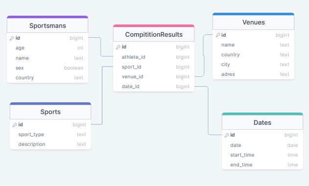

## 2. Нормализуем данные и прейдем к схеме снежинка.

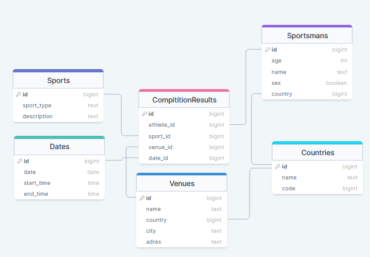

## 3. Реализуем полученную базу данных в субд.

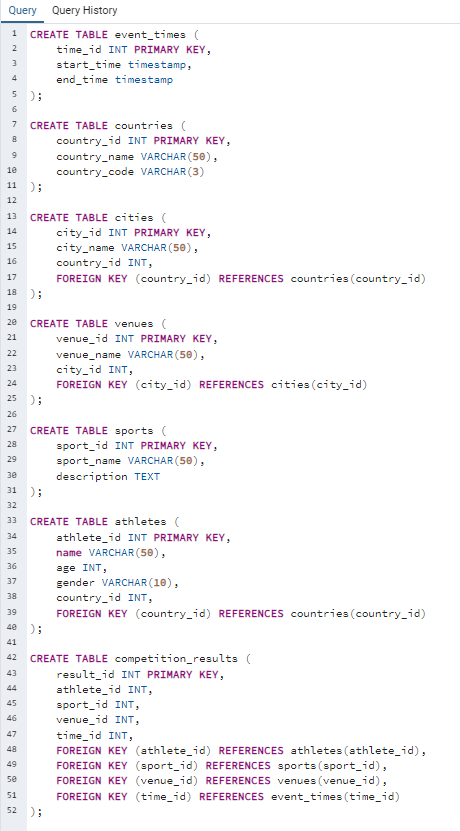

## 3. Заполним нашу базу данных по 10 строк в каждую таблицу.

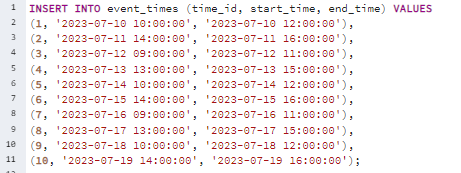

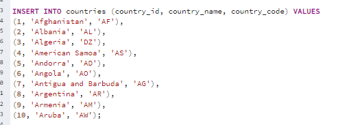

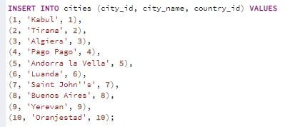

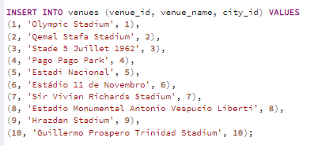

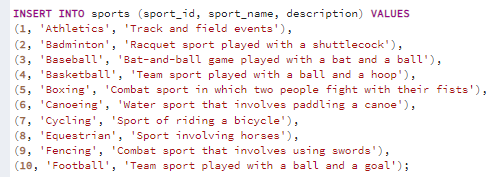

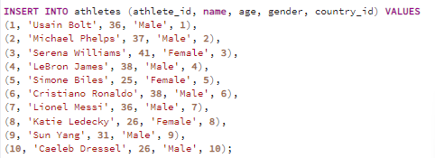

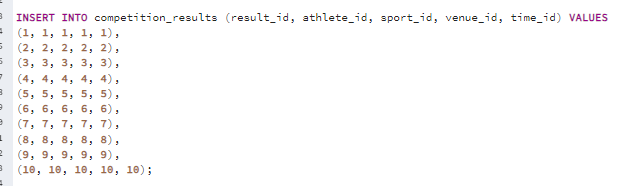

## 4. Реализуем несколько аналитических запросов в базу данных:

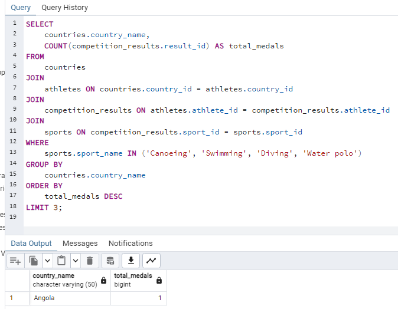

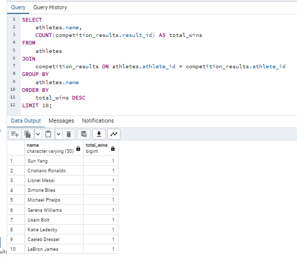

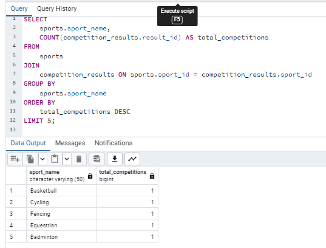

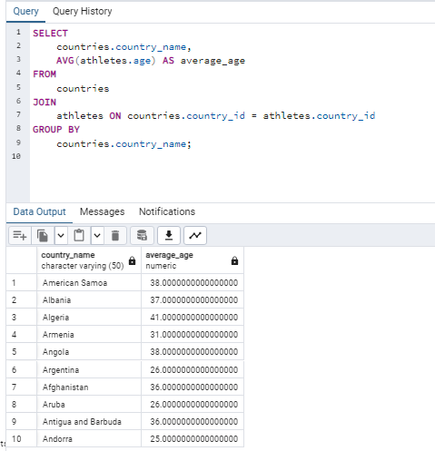

## 5. Выводы.
### В ходе выполнения данной лабораторной работы мы ознакомилимь и научились проектировать OLAP схемы баз данных. 

