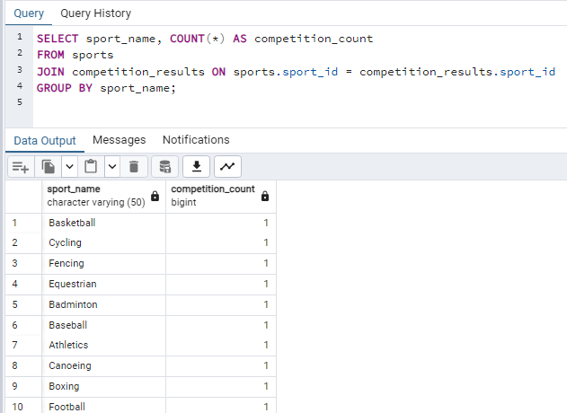
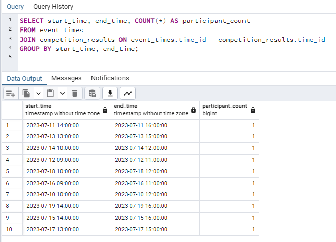

# Лабораторная работа 9
## Вариант 9, Минуллин Тимур, группа 11-209

## В ходе выполнения данной лабораторной работы мы выполним по 5 запросов на DISTINCT, HAVING, GROUP BY (без повторов) к OLAP базе данных из предыдущей работы.

## Запросы на DISTINCT.

### 1. Список уникальных стран, в которых проводились соревнования:

### 2. Список уникальных видов спорта, в которых участвовали спортсмены:

### 3. Список уникальных мест проведения соревнований:

### 4. Список уникальных спортсменов, участвовавших в соревнованиях:

### 5. Список уникальных времен проведения соревнований:

## Запросы на HAVING.

### 1. Страны с количеством медалей больше 10:

### 2. Виды спорта с количеством соревнований больше 50:

### 3. Места проведения соревнований с количеством проведенных соревнований больше 20:

### 4. Спортсмены с количеством медалей во всех видах спорта больше 5:

### 5. Времена проведения соревнований с количеством участников больше 100:

## Запросы на GROUP BY.

### 1. Количество медалей по странам:

### 2. Количество соревнований по видам спорта:

### 3. Количество проведенных соревнований по местам проведения:

### 4. Количество медалей по спортсменам:

### 5. Количество участников соревнований по времени проведения:

